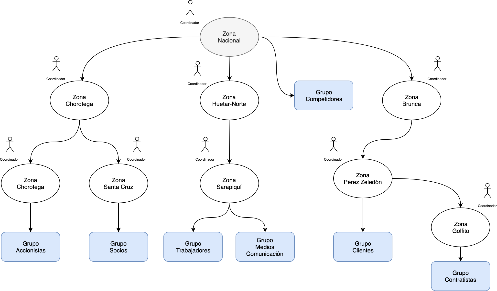
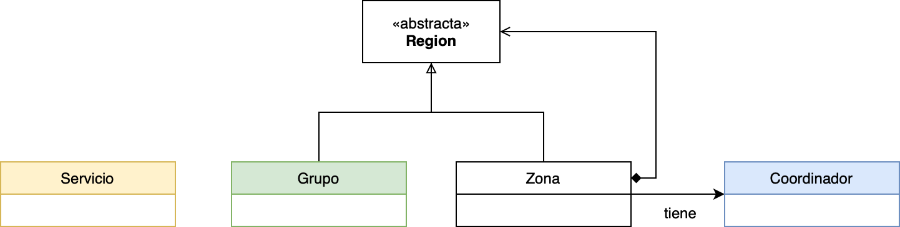

# **EIF204 Programación II**

> **UNIVERSIDAD NACIONAL**
>
> Escuela de Informática
>
> Facultad de Ciencias Exactas y Naturales
>
> EIF204 – Programación II – IC - 2022

| Examen parcial No.2          | **Fecha**: domingo 22 de mayo.          |
| ---------------------------- | --------------------------------------- |
| Prof. Santiago Caamaño P.    | Porcentaje de evaluación: 20%           |
| Prof. Gregorio Villalobos C. | Puntaje total: 100 pts.                 |
| Prof. Maikol Allan Guzmán    | Hora inicio: 9:00 am                    |
| Prof. Cristopher Montero     | Duración de la prueba es de **4 horas** |

## Problema

Para resolver este ejercicio, estudie el problema planteado y construya la solución adecuada.

### Descripción del problema.

Una empresa internacional desea tener un determinado grupo de interés en algunas de nuestras regiones del país para realizar proyección social en las distintas comunidades.  Ellos desean poner en operación un software que ayude en la construcción de estos grupos de interés, en el siguiente esquema se detalla un ejemplo del mismo. Se establece que la nación de Costa Rica se puede dividir en zonas. Un determinado grupo de interés de personas solo puede estar colocado en una sola zona. Este esquema solo integra ejemplificar algunos de los lugares puntuales y no abarca la totalidad del país.

Observe la siguiente situación a nivel nacional, como ejemplo:



En el anterior esquema se muestra una zona nacional que tiene 3 sub-zonas principales y un grupo de interés, que son: **la zona Chorotega, la zona Huetar Norte, la zona Brunca**, y un grupo de Competidores que pertenece a la **Zona Nacional**. El Zona Chorotega tiene dos sub-zonas que son: la zona de Nicoya y la zona de Santa Cruz y así con las otras regiones de la nación. 

Observar que <u>cada zona está bajo la responsabilidad de un coordinador de la empresa (cedula, nombre, edad), encargada(o) de la misma.</u> El esquema de las zonas podría ser más compleja, es decir, con otras zonas y más grupos de interés, pero siempre está organizada de manera jerárquica.

### Lo que se le solicita

El ejercicio solicitado consiste en construir e implementar un programa en C++ que lea los datos de las diferentes zonas del país, su coordinador, y además que calcule el presupuesto anual, cantidad de actividades y cantidad de asociados por zona que están en ese esquema, con respecto a las zonas que se tienen.

Las zonas del esquema tienen diferentes cantidades de presupuestos de acuerdo con su categoría:

| **Código  (int)** | **Nombre del  Grupo de Interés.** | **Presupuesto  anual (donado)** | **Actividades  por año** | **Cantidad  de Asociados** |
| :---------------: | :-------------------------------- | :-----------------------------: | :----------------------: | :------------------------: |
|        15         | **Accionistas**                   |            33 mills             |            30            |             35             |
|        52         | **Socios**                        |            39 mills             |            35            |             22             |
|        55         | **Trabajadores**                  |            15 mills             |            16            |             11             |
|        39         | **Clientes**                      |            14 mills             |            11            |             12             |
|        33         | **Competidores**                  |            25 mills             |            23            |             7              |
|        43         | **Contratistas**                  |            60 mills             |            42            |             44             |
|        37         | **Medios de Comunicación**        |            15 mills             |            18            |             23             |

Todos los grupos tienen un **código único** que indica su categoría. Además, la empresa dona a los diferentes grupos de interés, lo que cada uno presupuesta gastar al año.

Observe que la organización de la situación nacional por zonas simboliza una estructura jerárquica, que puede implementarse aplicando un patrón de diseño. 

Más adelante se presentará la estructura de datos de la Región, como un objeto compuesto con dos tipos de componentes: **grupo y zona**. Cada zona puede tener su grupo de interés, cuya información se encuentra con base en su categoría, y la cantidad de personas asociadas a ella. Por ejemplo, la zona de Sarapiquí abarca a dos grupos de interés y tiene entre ellas a: <u>11 + 23 = 34 asociados</u>.

La información de las zonas incluye:

- Nombre de la zona
- Zona a la que pertenece (si es el caso)
- Lista de grupos de interés.
- Lista de sub-zonas.

**Observe que la lista de grupos de interés y de sub-zonas es una única lista de componentes. Deberá implementarse de esa manera y no utilizando listas separadas.**

- A continuación, se muestra una declaración inicial de las clases a utilizar. 
- Las clases no están completas, pero son una base para el examen. 
- Hay que definir todos los métodos y atributos que sean necesarios, además se debe separar en (.h) y (.cpp) los archivos en el compilador.

```c++
class Region {
protected:
    double presupuesto;
    int cantidadDeActividades;
    int cantidadDeAsociados;
public:

    Region();

    Region(double presupuesto, int cantidadDeActividades, int cantidadDeAsociados);

    virtual ~Region();
  		
  	...

    virtual int obtenerTotalCantActividades() const = 0;

    virtual double obtenerTotalPresupuesto() const = 0;

    virtual int obtenerTotalCantidadAsociados() const = 0;

    virtual string toString() const;
};
```

```c++
class Grupo : public Region {
private:
    int codigo;
    string codigoGrupo;
    string nombreGrupo;
public:
    Grupo();

    Grupo(int codigo, const string &codigoGrupo, const string &nombreGrupo);

    virtual ~Grupo();
		
  	...
};
```

```c++
class Zona : public Region {
private:
    Persona *coordinador;
    string nombreZona;
    ...// Contenedor con lista tipo Template de elementos zona.

public:
    Zona();

    Zona(Persona *coordinador, const string &nombreZona);

    virtual ~Zona();

  	...
};
```

```c++
class Servicio {
public:
    Servicio();

    virtual ~Servicio();

    double obtenerPresupuesto(int codigo);
    int obtenerActividadPorAno(int codigo);
    int obtenerCantidadAsociados(int codigo);
};
```

Con base en las clases anteriores se deduce un posible DRC.



## Prueba y ejecución del Programa:

La prueba de ese modelo se realizará con las pruebas de unidad que ya tienen datos de prueba (quemados), donde se utilizará la organización del esquema inicial, que se trata de la situación nacional de donde solo se tienen ocho (8) grupos de interés en sus respectivas zonas, y eso es lo que hay. 

Notar a los coordinadores encargados (cedula, nombre y edad) por la Empresa Internacional de cada zona que tiene a su cargo.

## Rúbrica de evaluación

| RÚBRICA                                                      | PRUEBA UNIDAD | PTS  |
| ------------------------------------------------------------ | ------------- | :--: |
| Actividades por año                                          | Servicio_1    |  5   |
| Presupuesto anual                                            | Servicio_2    |  5   |
| Cantidad de asociados                                        | Servicio_3    |  3   |
| Verificación del constructor del grupo                       | Grupo_1       |  3   |
| toString() de Grupo                                          | Grupo_2       |  2   |
| toString() de Coordinador                                    | Coordinador   |  2   |
| Crear Zona Sarapiqui y agregar los contratistas              | Zona_1        |  5   |
| toString() de Zona Golfito                                   | Zona_2        |  5   |
| Presupuesto Zona Santa Cruz                                  | Calculo_1     |  5   |
| Presupuesto Zona Brunca                                      | Calculo_2     |  5   |
| Actividades por año Zona Huetar-Norte                        | Calculo_3     |  10  |
| Presupuesto Nacional excepto Zona Huetar-Norte               | Calculo_4     |  10  |
| Asociados para toda la Zona Nacional omitiendo la Chorotega  | Calculo_5     |  20  |
| Actividades, Presupuesto y Asociados de TODA la Zona Nacional | Calculo_6     |  20  |


