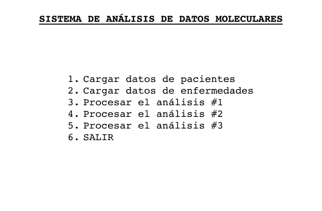
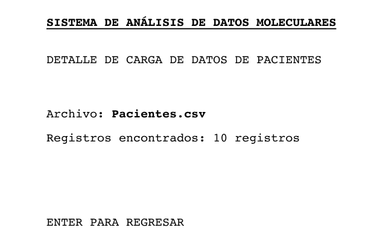
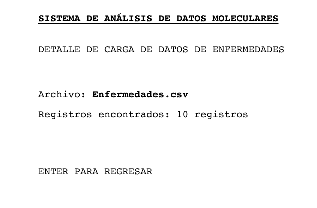
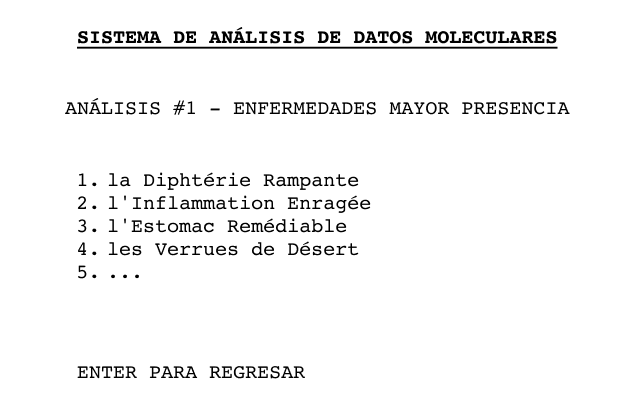
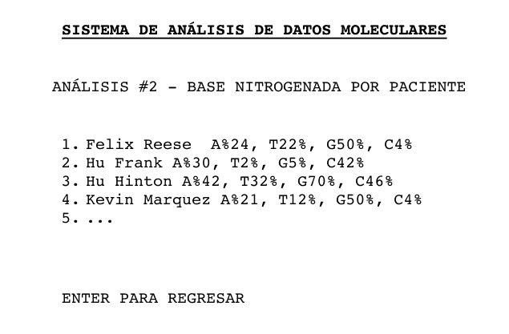
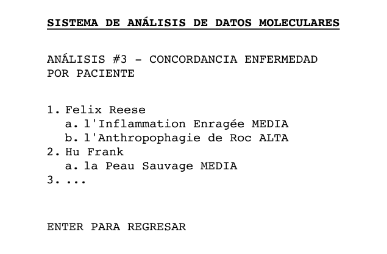
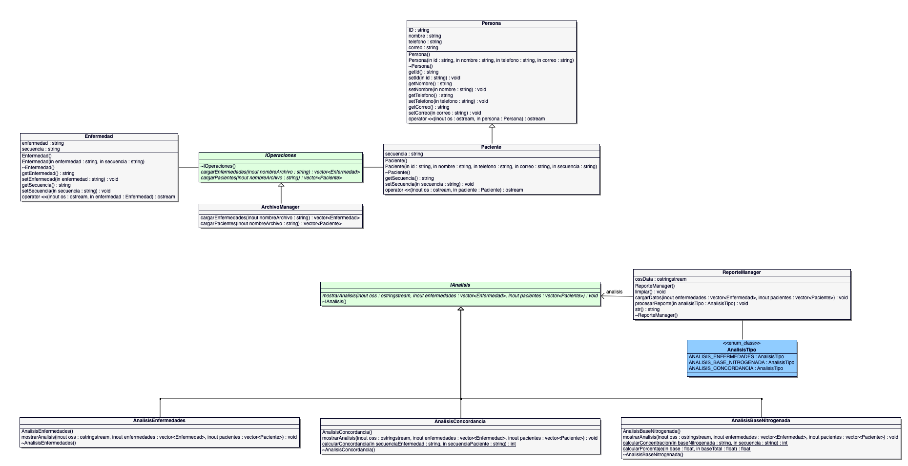

# Examen parcial No.3

> UNIVERSIDAD NACIONAL
>
> Escuela de Informática
>
> Facultad de Ciencias Exactas y Naturales
>
> EIF204 – Programación II – IC - 2022

| Profesores                   | **Fecha**: Sábado 25 de junio de 2022. |
| ---------------------------- | --------------------------------------- |
| Prof. Santiago Camaño P.    | Porcentaje de evaluación: 20%           |
| Prof. Gregorio Villalobos C. | Puntaje total: 100 pts.                 |
| Prof. Maikol Alán Guzmán     | Hora inicio: 9:00 am y finaliza a la 1:00 pm |
| Prof. Cristopher Montero     | Duración de la prueba es de **4 horas** |

# Temas a evaluar:

- Estándares de programación
- Manejo de errores
- Archivos de texto
- Patrones de diseño

# Problema

La **Universidad Nacional de Costa Rica** en conjunto con la **Escuela de Ciencias Biológicas y la Escuela de Informática**, está desarrollando un proyecto de software para identificar la susceptibilidad de pacientes de contraer ciertas enfermedades de carácter genético. Para esto es necesario comparar la huella genética de cada paciente (extracto de ADN) contra secuencias de ADN previamente identificadas que caracterizan cada una de las enfermedades.

El material genético se compone de cuatro bases nitrogenadas distintas, que tienen una representación mediante letras en el código genético: **adenina (A), timina (T), guanina (G) y citosina (C)** en el ADN. En el contexto computacional, una hilera de ADN se podría modelar con el tipo de datos de hilera. Así, por ejemplo, la secuencia de caracteres **“TGAAAAGAGAGTCTG”** es una secuencia de ADN válida.

Para este proyecto, cuenta con datos que describen a un conjunto de pacientes y una lista de enfermedades. A continuación se detallan los datos, las aplicaciones que deberá de crear y la funcionalidad requerida.

La Escuela de Informática ha establecido desarrollar una aplicación en C++ con la finalidad de analizar la información contenida en los archivos de datos. <u>También la escuela ha dispuesto como material de ayuda un algoritmo para simplificar el desarrollo de una parte del problema.</u>

# Lo que se solicita

De acuerdo a lo solicitado por los patrocinadores del proyecto, se solicita que el sistema tenga dos áreas, una para procesar datos de los archivos de texto y otra para analizar los datos.

## Procesamiento de datos 

Cargar y procesar dos archivos de texto con datos definidos en CSV (valores separados por comas)

1. **pacientes.csv**, este es un archivo de texto de tipo CSV, que contiene una lista de pacientes. Para cada paciente se describen sus datos personales y se tiene un extracto del ADN del mismo.
2. **enfermedades.csv**, este es un archivo de texto de tipo CSV, que contiene una lista de enfermedades cada una caracterizada por una secuencia de ADN marcadora.

## Análisis de datos

Para efectuar el análisis de los datos se podría implementar tres estratégias o algoritmos  diferentes cuyo objetivo es retornar los datos de un reporte, a partir de los pacientes y las enfermedades que se encuentran en los archivos.

- **Análisis #1 [Enfermedades]:** Generar un reporte de todas las enfermedades que se identifiquen en cada uno de los pacientes que tienen susceptibilidad de tenerla.
- **Análisis #2 [Base Nitrogenada]:** Generar un reporte que muestre la lista de pacientes y su concentración de cada base nitrogenada en términos porcentuales. Por ejemplo: Juan Perez [A - 24%, T - 22%, G - 50%, C - 4%].
- **Análisis #3 [Concordancia]:** Generar un reporte que muestre una lista de pacientes con el nombre de las enfermedades susceptibles, en términos de concordancia, por lo que si un paciente tiene más susceptibilidades, aumenta el riesgo de que se desarrollen dichas enfermedades. Se debe mostrar en el reporte la probabilidad de concordancia. Por ejemplo, se indica probabilidad **MEDIA** si existen 2 concordancias, mientras que 3 o más concordancias indican una probabilidad **ALTA** que el paciente desarrolle dichas condiciones de salud.

# Pantallas del sistema













# Material de Apoyo

## UML



## Algoritmo

### Determina repeticiones en un strings()

```c++
/**
* Algoritmo que permite determinar la repetición de una letra o conjunto de letras en un
* texto base. Ejemplo: textoBuscar: abc, textoBase: abcdewabc, retorna 2 coincidencias
* @param textoBuscar string que se busca en un texto base
* @param textoBase es el textoBase
* @return la cantidad de veces que se repite el textoBuscar
*/
int calcularRepeticiones(const string& textoBuscar, const string& textoBase) {
   int repeticiones = 0;
   unsigned long index = 0; // variable para la posición donde se encuentra la letra
   // El siguiente ciclo permite recorrer el string para identificar las veces que se
   // repite un carácter
   while ((index = textoBase.find(textoBuscar, index)) != std::string::npos) {
       index += textoBuscar.length();
       repeticiones++;
   }
   return repeticiones;
}
```

### Elimina el caracter de retorno en una linea de texto

```c++
#include <algorithm>
#include <string>
using namespace std;

string myTextLine;
myTextLine.erase(remove(myTextLine.begin(), myTextLine.end(), '\r'), myTextLine.end());

```


# Evaluación

| RÚBRICA                                                      |      PRUEBA UNIDAD      | PTS  |
| ------------------------------------------------------------ | :---------------------: | :--: |
| **[ARCHIVOS]** Procesamiento correcto de los pacientes       |     CargaPacientes      |  15  |
| **[MANEJO DE ERRORES]** Uso correcto de las excepciones y el try catch. |   CargaPacientesError   |  5   |
| **[ARCHIVOS]** Procesamiento correcto de los enfermedades    |    CargaEnfermedades    |  15  |
| **[MANEJO DE ERRORES]** Uso correcto de las excepciones y el try catch. | CargaEnfermedadesError  |  5   |
| **[REPORTE]** Evaluar el resultado del análisis #1           |  AnalisisEnfermedades   |  20  |
| **[REPORTE]** Evaluar el resultado del análisis #2           | AnalisisBaseNitrogenada |  20  |
| **[REPORTE]** Evaluar el resultado del análisis #3           |  AnalisisConcordancia   |  20  |
